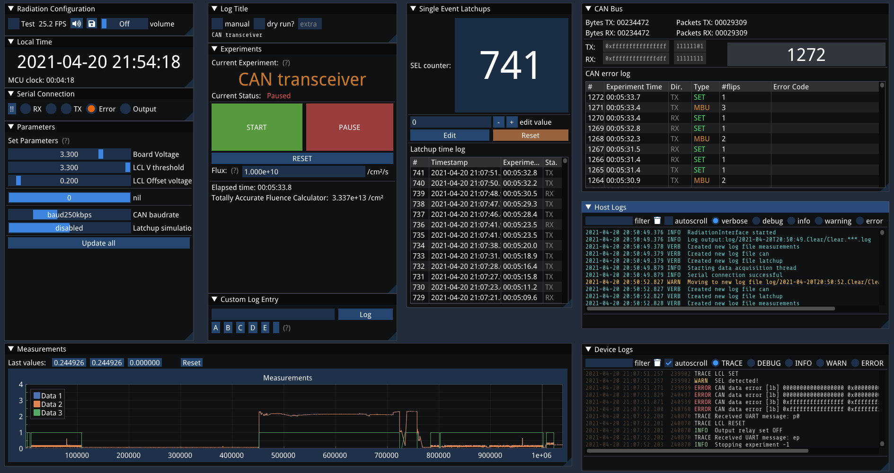

# RTB Software

The RTB (Radiation Test Board) software suite is composed from two parts:
- Firmware for the STMicroelectronics NUCLEO-H743ZI board, designed to interface with the system hardware and Latchup Current Limiters
- A desktop interface written in C++ and communicating with the microcontroller board with the UART protocol via USB

## Desktop Interface


The desktop interface is responsible for fully controlling and receiving data from the microcontroller. It is designed to be simple and intuitive to use.

### Running an experiment
The functionality of the software is designed around different "Experiments", which are tied to different functions.

Most experiments involve static tests, and therefore only turn the DUT (Device Under Test) ON or OFF.
Other tests (e.g. CAN bus, MRAM, Op-Amp) may add some dynamic behaviour.

To start testing, select your experiment and click _START_ on the _Experiments_ window. The device is powered only if an experiment has started. If you only wish to power the device without performing specific measurements, just select the _Clear_ experiment.

### Windows

The interface is composed of collapsible, movable and resizable windows, as described in the following sections. The window configuration is persistent after program restarts, so you can feel free to configure the app to meet your workflow.


#### Radiation Configuration
Generic information and options for the program. Among others, the user can toggle or set the volume for the "beep" sounds generated on errors.

#### Local Time
A large time display to keep track of experiment/facility time.

Three distinct times are used and logged by the app:
- The system time (based on the system clock), which is absolute and can be used between experiments. Uses the local timezone and is the most accurate clock of the 3.
- The MCU (microcontroller) time. Shows the number of seconds since the last boot of the microcontroller.
- The experiment time. This starts being measured as soon as the _START_ button is pressed, is paused when the device is powered down, and is reset when a new experiment starts. This is useful for an intuitive interpretation of measurements, but may be inacurrate in case of events happening when the device is not seen to be powered.

#### Serial Connection
Status indicators and control of the USB UART connection to the microcontroller.

#### Parameters
All configurable parameters can be set from here. No parameter is actually updated unless the user presses the _Update_ button.

Note that some of these parameters may automatically change when a different experiment is selected.

#### Log Title
All microcontroller inputs and user actions are logged in the `log` directory. The _Log Title_ window is responsible for setting the name of those log files.

Two modes are offered, in order to increase flexibility and usability during a test:
1. _Manual_ mode, where the user specifies the log file name manually once.
2. _Automatic_ mode, where the name is based on the _Current Experiment_. The user can specify additional text to add to the log name (e.g. device number, number of run)

Log files include the host (desktop) logs, device (microcontroller) logs, and a number of `.csv` files for measurement and event data.

#### Custom Log Entry
The user can manually append timestamped entries to the log, in order to mark events or milestones during testing without having to mess with paper.

A number of _shortcut buttons_ can be set using _Ctrl+Click_ to provide quick access to common log messages.

#### Experiments
This is where the user chooses to START, PAUSE or RESET an experiment as described above.

When an experiment is RESET, the data from all other windows is cleared, and new log files are created. The data from the previous runs remains stored on the hard drive.

An additional _"flux"_ input allows the user to get a ballpark measurement of the total fluence, to gain insight on irradiation status.

#### Single Event Latchups
This window indicates the number and timestamps of overcurrent conditions that were detected and resolved by the microcontroller.

#### MRAM

The MRAM window includes statistics about the MRAM data written and read from the memory, as well as a log of error timestamp and types. The following information is stored and reported in real time for each error:
- Memory address
- Written (expected) value
- Read value for both read attempts
- Guessed error type
- No# of bit flips

#### CAN Bus
The CAN window includes statistics about the successful CAN packets sent between the transceivers (1 irradiated + 1 ambient), and a log of error timestamp and types. The number of total errors and exact position of the bit flips are also shown and logged.

#### Logs
All events, actions and notifications are shown on the Log windows. Two types of logs are shown:
- _Host Logs_, for any information generated by the desktop interface (e.g. file writing errors, custom entries, parameter updates)
- _Device Logs_, for any information generated by the microcontroller (e.g. latchups, experiment status, errors detected, exceptions).

Each log entry has a specified severity. A filter allows the user to focus on the more important log entries to investigate various occurences.

All logs are stored in the corresponding log files, and flushed immediately.

#### Measurements
A real-time view of analog & digital voltage measurements by the microcontroller (e.g. component current consumption, output status).

All measurements are stored in the corresponding `.csv` file.

## Commanding

Set up Minicom with the following command:
```bash
sudo minicom -c on -D /dev/ttyACM0 -b 2000000
```

You can type `Ctrl+A` and then `E` to see your commands as you type them.

**Do not use Minicom along with the Radiation interface**. This section is provided for quick debugging purposes.

## Installation
This is a typical CMake package. Make sure to add the following change to imgui so that ImPlot doesn't crash:
```patch
diff --git a/imconfig.h b/imconfig.h
index 39de21c6..631de460 100644
--- a/imconfig.h
+++ b/imconfig.h
@@ -90,7 +90,7 @@
 // Your renderer backend will need to support it (most example renderer backends support both 16/32-bit indices).
 // Another way to allow large meshes while keeping 16-bit indices is to handle ImDrawCmd::VtxOffset in your renderer.
 // Read about ImGuiBackendFlags_RendererHasVtxOffset for details.
-//#define ImDrawIdx unsigned int
+#define ImDrawIdx unsigned int
 
 //---- Override ImDrawCallback signature (will need to modify renderer backends accordingly)
 //struct ImDrawList;
```

# Frequent issues/problems
Q: **The Radiation Interface logs and serial output show garbage**  
A: Make sure to have minicom or other serial readers off while using the Radiation Interface.

Q: **The timezone shows up as `Etc/Space`**  
A: The Radiation Interface has not been tested on Windows. Linux is suggested for use.

Q: **A lot of libraries (implot, log, imgui) show up as non-existent**
A: Make sure to clone all git submodules before installing this project!
